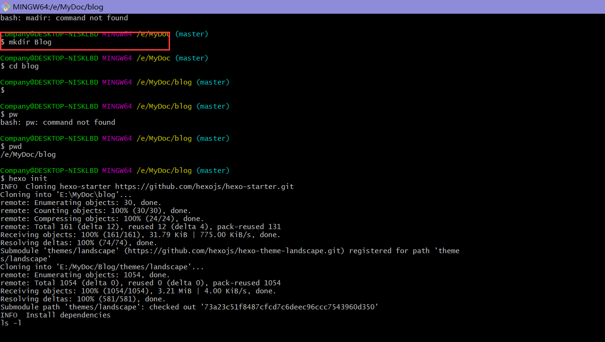

### Tips:前期准备安装
- __<u>[Git](https://git-scm.com/)</u>__ 
- __<u>[Node.js](https://nodejs.org/zh-cn/ )</u>__ 
- __安装淘宝的npm镜像__
  由于node安装插件是从国外服务器下载，受网络影响大，速度慢且可能出现异常。所以如果npm的服务器在中国就好了，所以我们乐于分享的淘宝团队（阿里巴巴旗下业务阿里云）干了这事。来自官网：“这是一个完整 npmjs.org 镜像，你可以用此代替官方版本(只读)，同步频率目前为 10分钟 一次以保证尽量与官方服务同步.  
  _以后用到`npm`直接改成`cnpm`代替即可_.
---
    npm install -g cnpm --registry=https://registry.npm.taobao.org 

<!-- more -->
## 1.使用npm安装<u>[Hexo](https://hexo.io/zh-cn/)</u>
安装了淘宝镜像的，这里可以把npm替换为cnpm，下面是贴的官网代码😂.

    $ npm install -g hexo-cli

## 2.初始化Hexo
我使用命令`$ mkdir Blog`这里创建了一个放博客的文件夹取名为Blog，然后在该目录下执行以下初始化命令如下，完成后，
Blog这个文件夹可以看到生成的文件如下图：

    $ hexo init

## 3.启动Hexo
使用以下命令启动Hexo博客，然后浏览器输入服务地址即可看到。
如下图：  

    $ hexo -s

## 4.试着写一篇博客
4.1使用以下命令创建博客，我这里采用的[Markdown](https://markdown-zh.readthedocs.io/en/latest/)语法写的.  
_学习成本超低,实话说，我也是第一次写，望多多指教._  
我这里使用的VsCode编辑器.  

    $ hexo n "我的博客(自定义名称)"

4.2 写完后,使用以下命令清除缓存文件 (db.json) 和已生成的静态文件 (public)。
在某些情况（尤其是更换主题后），如果发现您对站点的更改无论如何也不生效，您可能需要运行该命令。  

    $ hexo clean

4.3 生成静态文件  

    $ hexo g

4.4 使用以下命令启动服务，浏览器输入服务地址刷新即可.

    $ hexo s

## 5.发布GtiHub上
5.1 在GitHub上创建一个仓库如下图  
***新建一个 repository。如果你希望你的站点能通过 <你的 GitHub 用户名>.github.io 域名访问，你的 repository 应该直接命名为 <你的 GitHub 用户名>.github.io。--[来源Hexo官网](https://hexo.io/zh-cn/docs/github-pages)***

5.2 使用以下命令安装 **[ hexo-deployer-git](https://github.com/hexojs/hexo-deployer-git)** 来 **[一键部署](https://hexo.io/zh-cn/docs/one-command-deployment)** 到GitHub上命令如下:  

    $ npm install hexo-deployer-git --save

5.3 修改主目录下的配置文件`_config.yml`.

5.4 最后使用如下命令，然后输入GitHub账号密码发布上去即可。完成后会看到GitHub仓库里面有文件如下图,然后通过 jaminfu.github.io    
ps:这里我替换了默认的主题。  
感谢主题作者,[点此链接查看](https://github.com/litten/hexo-theme-yilia)

    $ hexo d

>### 第一次搭建Hexo博客，第一次写文章，总的来说还是挺顺的，刚学的Markdown语法，正好用来练手，同时也纪念下学习过程，写的好慢啊，如有不合理的地方评论区指正，我会努力改进的，谢谢！

* __作者: Jm_fu__  
* __版权：转载请注明出处！__
