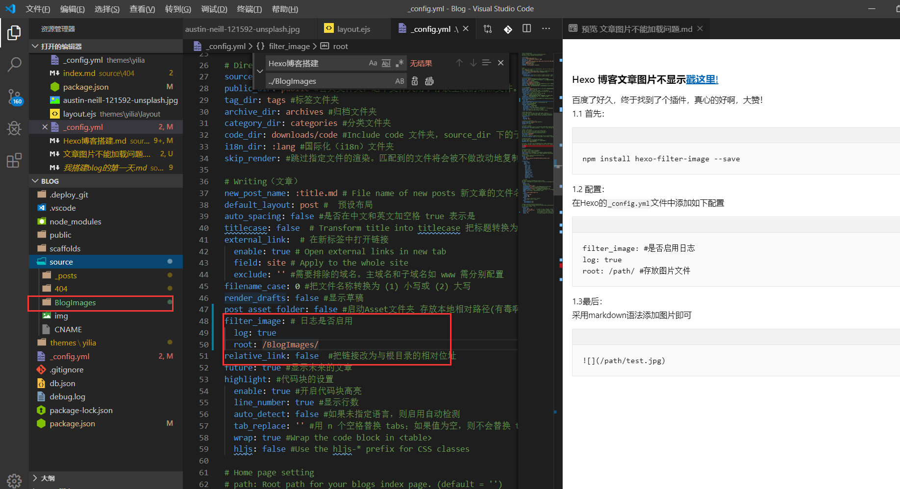

### Hexo 博客文章图片不显示[戳这里!](https://npm.taobao.org/package/hexo-filter-image)
百度了好久，终于找到了个插件，真心的好啊，感谢作者，大赞！  
1.1 首先：

    npm install hexo-filter-image --save
<!--more-->
1.2 配置：  
在Hexo的`_config.yml`文件中添加如下配置

    filter_image: #是否启用日志
    log: true
    root: /path/ #存放图片文件
1.3最后：  
采用markdown语法添加图片即可,可能第一次使用有缓存，`hexo clean`
清除即可！
    

* __作者: Jm_fu__  
* __版权：转载请注明出处！__